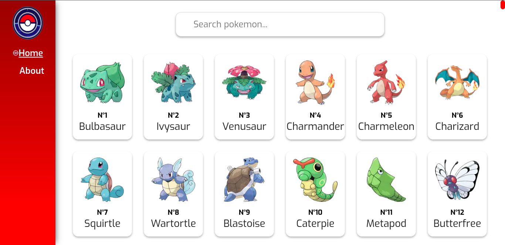
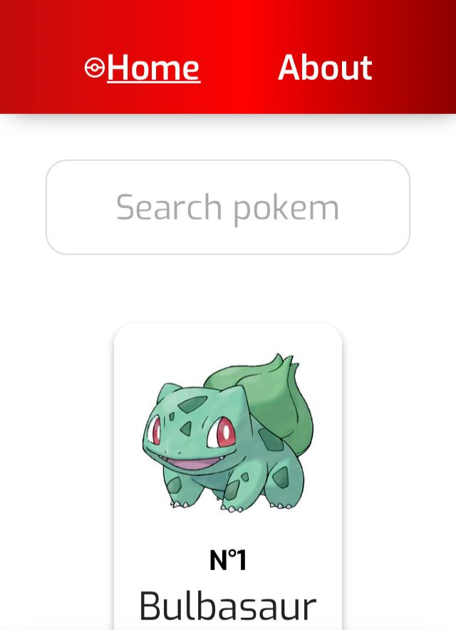
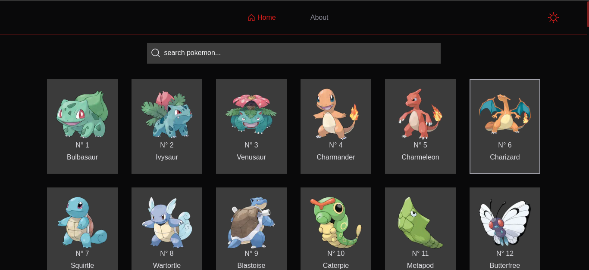
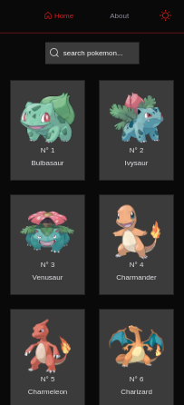

# Pokédex Next

<p>
  Pokedéx developed with Nextjs, TypeScript and Tailwind.
</p>

<p>
  The project consumes the data from the <a href='https://pokeapi.co/' target='_blank'>PokeApi</a> and renders it through the Next.JS SSR
</p>

## App URL

```
https://pokedex-next-flax.vercel.app/
```

## Installation

### Clone

```
git clone https://github.com/jovimoura/pokedex-next
```

### Access the folder

```
cd <name-folder>
```

### Install dependencies

```
npm i
```

### Start the app

```
npm run dev
```

### Port:

```
http://localhost:3000/
```

## Images of project

### 1.0.0:





### 2.0.1:





## Tecnologies and Libs:

<ul>
    <li>Next</li>
    <li>TypeScript</li>
    <li>Tailwind</li>
</ul>

## Made by:

### João Victor dos Santos Moura

### E-mail: joaovictors.mouraa@gmail.com

### Linkedin: https://www.linkedin.com/in/jovimoura10/
