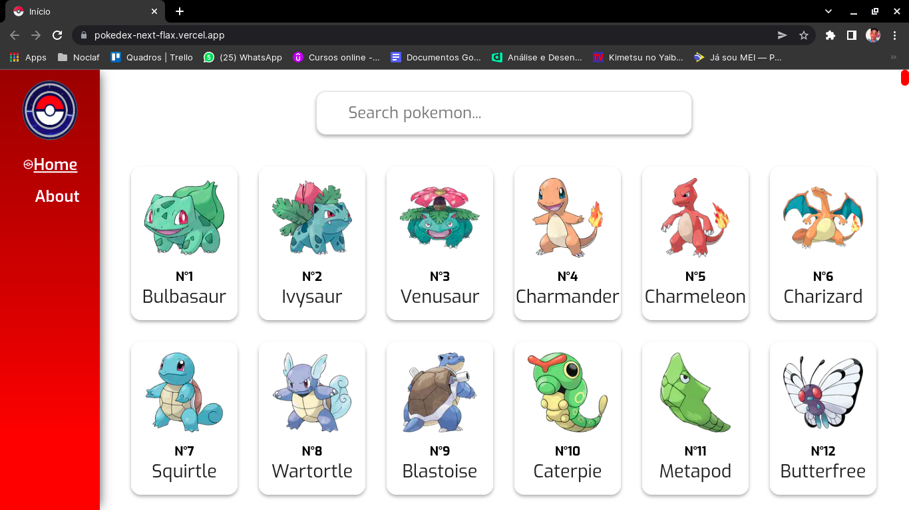
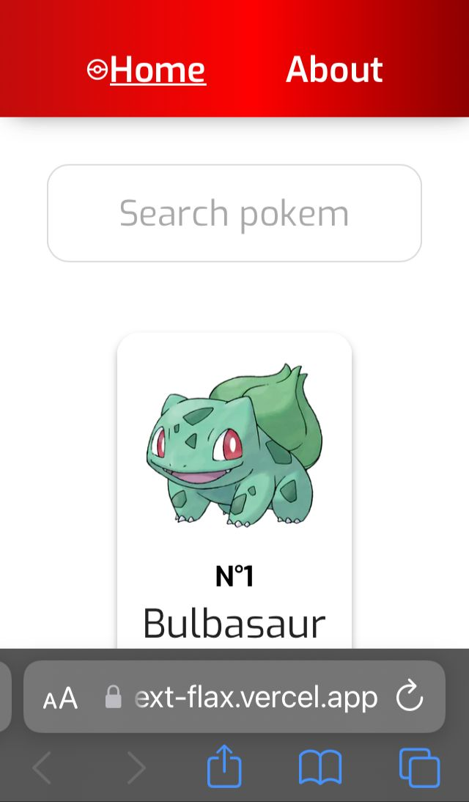

# Pokedex 📱

<p>
  🇺🇸 The project is a pokedex developed with Next.js, React and JavaScript!
</p>

<p>
  The project consumes the data from the <a href='https://pokeapi.co/' target='_blank'>PokeApi</a> and renders it through the Next.JS SSR
</p>

<br/>

<p>
  🇧🇷 O projeto trata-se de uma pokedex desenvolvida com Next.js, React e JavaScript!
</p>

<p>
  O projeto consome os dados da <a href='https://pokeapi.co/' target='_blank'>PokeApi</a> e os renderiza através do SSR do Next.JS
</p>


# 🇧🇷 A aplicação está on-line no link. 🇺🇸 The application is online at the link:


```
https://pokedex-next-flax.vercel.app/
```

## 🇺🇸 If you want to analyze the project on your machine, follow this step by step. 🇧🇷 Caso você queira analisar o projeto em sua máquina, siga este passo a passo: 😁

<br>

## 🇺🇸

### Clone😎

```
git clone https://github.com/jovimoura/pokedex-next
```

### Access the folder🤓

```
cd <folder>
```
### Install dependencies🤠
```
npm install
```
### Start application🤩
```
npm run serve
```
### default port:🤗

```
http://localhost:3000/
```

<br>

## 🇧🇷

### Clone o repositório😎

```
git clone https://github.com/jovimoura/pokedex-next
```

### Acesse o diretorio🤓

```
cd <nome-da-pasta>
```
### Instale as dependências🤠
```
npm install
```
### Inicie a aplicação🤩
```
npm run serve
```
### A aplicação, por padrão, fica na porta:🤗

```
http://localhost:3000/
```

## 🇺🇸 Image | 🇧🇷 Imagem do projeto  💻



<br/>

## Responsive design 📱



##  🇺🇸 Tecnologies and Libs | 🇧🇷 Tecnologias e Bibliotecas utilizadas🦉

<ul>
    <li>Next.JS</li>
    <li>React</li>
    <li>JavaScript</li>
    <li>AOS</li>
</ul>

##  🇧🇷 Feito por / 🇺🇸 Made by:

### João Victor dos Santos Moura
### E-mail: joaovictors.mouraa@gmail.com
### Linkedin: https://www.linkedin.com/in/jovimoura10/
